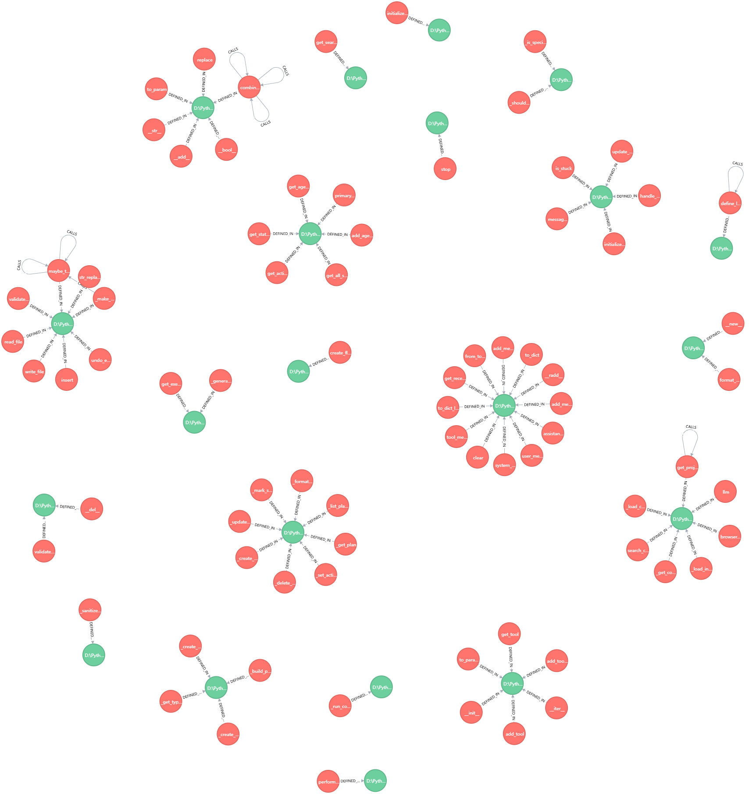

# PyGraphAnalyzer

PyGraphAnalyzer 是一个用于分析 Python 项目代码结构的工具，能够生成 Cypher 语句来表示函数调用关系，并将其可视化在图数据库中。

## 功能特性

- 解析 Python 项目中的函数定义
- 分析函数之间的调用关系
- 生成 Cypher 语句用于图数据库
- 支持将结果保存到文件

## 使用说明

1. 克隆本仓库
   ```bash
   git clone https://github.com/yourusername/pygraphanalyzer.git
   ```
1.  安装依赖
 ```bash
   pip install pycparser
 ```
1. 修改要分析的python项目路径和输出cypher文件保存路径
```python
 project_path = "D:\\PythonWorkspace\\OpenManus-main"  # 修改为你的Python项目路径
 ...
 output_file = "output.cypher"  # 修改为输出Cypher语句的文件路径
```
1.  运行分析工具
 ```bash
   python python_code_analyzer.py
 ```
1.  查看输出结果   
   - 生成的 Cypher 语句会保存在 output.cypher 文件中
   - 可以在 Neo4j 等图数据库中导入这些 Cypher 语句
## 配置选项
- project_path : 要分析的 Python 项目路径
- output_file : Cypher 语句输出文件路径
## 示例输出
分析开源项目 [OpenManus](https://github.com/mannaandpoem/OpenManus)源代码，并生成图数据（代码知识图谱）Cypher语句： 
```cypher
MERGE (f:PythonFile {path: 'D:\\PythonWorkspace\\OpenManus-main\\app\\config.py'});
MERGE (f:PythonFile {path: 'D:\\PythonWorkspace\\OpenManus-main\\app\\flow\\planning.py'});
MERGE (f:PythonFile {path: 'D:\\PythonWorkspace\\OpenManus-main\\app\\schema.py'});
MERGE (f:PythonFile {path: 'D:\\PythonWorkspace\\OpenManus-main\\app\\tool\\terminal.py'});
MERGE (f:PythonFile {path: 'D:\\PythonWorkspace\\OpenManus-main\\app\\flow\\base.py'});
MERGE (f:PythonFile {path: 'D:\\PythonWorkspace\\OpenManus-main\\app\\tool\\browser_use_tool.py'});
MERGE (f:PythonFile {path: 'D:\\PythonWorkspace\\OpenManus-main\\app\\tool\\tool_collection.py'});
MERGE (f:PythonFile {path: 'D:\\PythonWorkspace\\OpenManus-main\\app\\flow\\base.py'});
MERGE (f:PythonFile {path: 'D:\\PythonWorkspace\\OpenManus-main\\app\\tool\\create_chat_completion.py'});
MERGE (f:PythonFile {path: 'D:\\PythonWorkspace\\OpenManus-main\\app\\agent\\planning.py'});
MERGE (f:PythonFile {path: 'D:\\PythonWorkspace\\OpenManus-main\\app\\tool\\base.py'});
MERGE (f:PythonFile {path: 'D:\\PythonWorkspace\\OpenManus-main\\app\\schema.py'});
MERGE (f:PythonFile {path: 'D:\\PythonWorkspace\\OpenManus-main\\app\\flow\\flow_factory.py'});
MERGE (f:PythonFile {path: 'D:\\PythonWorkspace\\OpenManus-main\\app\\config.py'});
MERGE (f:PythonFile {path: 'D:\\PythonWorkspace\\OpenManus-main\\app\\tool\\base.py'});
MERGE (f:PythonFile {path: 'D:\\PythonWorkspace\\OpenManus-main\\app\\llm.py'});
MERGE (f:PythonFile {path: 'D:\\PythonWorkspace\\OpenManus-main\\app\\tool\\python_execute.py'});
MERGE (f:PythonFile {path: 'D:\\PythonWorkspace\\OpenManus-main\\app\\tool\\bash.py'});
MERGE (f:PythonFile {path: 'D:\\PythonWorkspace\\OpenManus-main\\app\\tool\\str_replace_editor.py'});
MERGE (f:PythonFile {path: 'D:\\PythonWorkspace\\OpenManus-main\\app\\schema.py'});
MERGE (f:PythonFile {path: 'D:\\PythonWorkspace\\OpenManus-main\\app\\schema.py'});
MERGE (f:PythonFile {path: 'D:\\PythonWorkspace\\OpenManus-main\\app\\config.py'});
MERGE (f:PythonFile {path: 'D:\\PythonWorkspace\\OpenManus-main\\app\\flow\\planning.py'});
MERGE (f:PythonFile {path: 'D:\\PythonWorkspace\\OpenManus-main\\app\\schema.py'});
MERGE (f:PythonFile {path: 'D:\\PythonWorkspace\\OpenManus-main\\app\\tool\\tool_collection.py'});
MERGE (f:PythonFile {path: 'D:\\PythonWorkspace\\OpenManus-main\\app\\llm.py'});
MERGE (f:PythonFile {path: 'D:\\PythonWorkspace\\OpenManus-main\\app\\agent\\base.py'});
MERGE (f:PythonFile {path: 'D:\\PythonWorkspace\\OpenManus-main\\app\\tool\\str_replace_editor.py'});
MERGE (f:PythonFile {path: 'D:\\PythonWorkspace\\OpenManus-main\\app\\tool\\planning.py'});
MERGE (f:PythonFile {path: 'D:\\PythonWorkspace\\OpenManus-main\\app\\tool\\str_replace_editor.py'});
MERGE (f:PythonFile {path: 'D:\\PythonWorkspace\\OpenManus-main\\app\\tool\\planning.py'});
MERGE (f:PythonFile {path: 'D:\\PythonWorkspace\\OpenManus-main\\app\\schema.py'});
MERGE (f:PythonFile {path: 'D:\\PythonWorkspace\\OpenManus-main\\app\\schema.py'});
MERGE (f:PythonFile {path: 'D:\\PythonWorkspace\\OpenManus-main\\app\\agent\\toolcall.py'});
MERGE (f:PythonFile {path: 'D:\\PythonWorkspace\\OpenManus-main\\app\\agent\\base.py'});
MERGE (f:PythonFile {path: 'D:\\PythonWorkspace\\OpenManus-main\\app\\tool\\planning.py'});
MERGE (f:PythonFile {path: 'D:\\PythonWorkspace\\OpenManus-main\\app\\tool\\str_replace_editor.py'});
MERGE (f:PythonFile {path: 'D:\\PythonWorkspace\\OpenManus-main\\app\\tool\\base.py'});
MERGE (f:PythonFile {path: 'D:\\PythonWorkspace\\OpenManus-main\\app\\flow\\base.py'});
MERGE (f:PythonFile {path: 'D:\\PythonWorkspace\\OpenManus-main\\app\\agent\\base.py'});
MERGE (f:PythonFile {path: 'D:\\PythonWorkspace\\OpenManus-main\\app\\config.py'});
MERGE (f:PythonFile {path: 'D:\\PythonWorkspace\\OpenManus-main\\app\\tool\\browser_use_tool.py'});
MERGE (f:PythonFile {path: 'D:\\PythonWorkspace\\OpenManus-main\\app\\tool\\planning.py'});
MERGE (f:PythonFile {path: 'D:\\PythonWorkspace\\OpenManus-main\\app\\tool\\planning.py'});
MERGE (f:PythonFile {path: 'D:\\PythonWorkspace\\OpenManus-main\\app\\schema.py'});
MERGE (f:PythonFile {path: 'D:\\PythonWorkspace\\OpenManus-main\\app\\agent\\toolcall.py'});
MERGE (f:PythonFile {path: 'D:\\PythonWorkspace\\OpenManus-main\\app\\tool\\base.py'});
MERGE (f:PythonFile {path: 'D:\\PythonWorkspace\\OpenManus-main\\app\\flow\\base.py'});
MERGE (f:PythonFile {path: 'D:\\PythonWorkspace\\OpenManus-main\\app\\schema.py'});
MERGE (f:PythonFile {path: 'D:\\PythonWorkspace\\OpenManus-main\\app\\tool\\tool_collection.py'});
MERGE (f:PythonFile {path: 'D:\\PythonWorkspace\\OpenManus-main\\app\\tool\\create_chat_completion.py'});
MERGE (f:PythonFile {path: 'D:\\PythonWorkspace\\OpenManus-main\\app\\tool\\tool_collection.py'});
MERGE (f:PythonFile {path: 'D:\\PythonWorkspace\\OpenManus-main\\app\\config.py'});
MERGE (f:PythonFile {path: 'D:\\PythonWorkspace\\OpenManus-main\\app\\schema.py'});
MERGE (f:PythonFile {path: 'D:\\PythonWorkspace\\OpenManus-main\\app\\tool\\create_chat_completion.py'});
MERGE (f:PythonFile {path: 'D:\\PythonWorkspace\\OpenManus-main\\app\\tool\\web_search.py'});
MERGE (f:PythonFile {path: 'D:\\PythonWorkspace\\OpenManus-main\\app\\flow\\base.py'});
MERGE (f:PythonFile {path: 'D:\\PythonWorkspace\\OpenManus-main\\app\\tool\\tool_collection.py'});
MERGE (f:PythonFile {path: 'D:\\PythonWorkspace\\OpenManus-main\\app\\config.py'});
MERGE (f:PythonFile {path: 'D:\\PythonWorkspace\\OpenManus-main\\app\\tool\\str_replace_editor.py'});
MERGE (f:PythonFile {path: 'D:\\PythonWorkspace\\OpenManus-main\\app\\agent\\base.py'});
MERGE (f:PythonFile {path: 'D:\\PythonWorkspace\\OpenManus-main\\app\\schema.py'});
MERGE (f:PythonFile {path: 'D:\\PythonWorkspace\\OpenManus-main\\app\\tool\\str_replace_editor.py'});
MERGE (f:PythonFile {path: 'D:\\PythonWorkspace\\OpenManus-main\\app\\config.py'});
MERGE (f:PythonFile {path: 'D:\\PythonWorkspace\\OpenManus-main\\app\\agent\\base.py'});
MERGE (f:PythonFile {path: 'D:\\PythonWorkspace\\OpenManus-main\\app\\tool\\planning.py'});
MERGE (f:PythonFile {path: 'D:\\PythonWorkspace\\OpenManus-main\\app\\logger.py'});
MERGE (f:PythonFile {path: 'D:\\PythonWorkspace\\OpenManus-main\\app\\tool\\base.py'});
MERGE (f:PythonFile {path: 'D:\\PythonWorkspace\\OpenManus-main\\app\\tool\\search\\google_search.py'});
MERGE (f:PythonFile {path: 'D:\\PythonWorkspace\\OpenManus-main\\app\\flow\\base.py'});
MERGE (f:PythonFile {path: 'D:\\PythonWorkspace\\OpenManus-main\\app\\tool\\str_replace_editor.py'});
MERGE (f:PythonFile {path: 'D:\\PythonWorkspace\\OpenManus-main\\app\\tool\\planning.py'});
MERGE (f:PythonFile {path: 'D:\\PythonWorkspace\\OpenManus-main\\app\\tool\\tool_collection.py'});
MERGE (f:PythonFile {path: 'D:\\PythonWorkspace\\OpenManus-main\\app\\tool\\planning.py'});
MERGE (f:PythonFile {path: 'D:\\PythonWorkspace\\OpenManus-main\\app\\tool\\create_chat_completion.py'});
MERGE (f:PythonFile {path: 'D:\\PythonWorkspace\\OpenManus-main\\app\\tool\\base.py'});
MERGE (f:PythonFile {path: 'D:\\PythonWorkspace\\OpenManus-main\\app\\schema.py'});
MERGE (f:PythonFile {path: 'D:\\PythonWorkspace\\OpenManus-main\\app\\tool\\str_replace_editor.py'});
CREATE (fn:PythonFunction {name: 'get_project_root', line_number: 9, file_name: 'config.py'});
MATCH (f:PythonFile {path: 'D:\\PythonWorkspace\\OpenManus-main\\app\\config.py'}), (fn:PythonFunction {name: 'get_project_root'}) CREATE (fn)-[:DEFINED_IN {line_number: 9}]->(f);
CREATE (fn:PythonFunction {name: '__new__', line_number: 21, file_name: 'llm.py'});
MATCH (f:PythonFile {path: 'D:\\PythonWorkspace\\OpenManus-main\\app\\llm.py'}), (fn:PythonFunction {name: '__new__'}) CREATE (fn)-[:DEFINED_IN {line_number: 21}]->(f);
CREATE (fn:PythonFunction {name: '__init__', line_number: 11, file_name: 'tool_collection.py'});
MATCH (f:PythonFile {path: 'D:\\PythonWorkspace\\OpenManus-main\\app\\tool\\tool_collection.py'}), (fn:PythonFunction {name: '__init__'}) CREATE (fn)-[:DEFINED_IN {line_number: 11}]->(f);
CREATE (fn:PythonFunction {name: '_get_config_path', line_number: 92, file_name: 'config.py'});
MATCH (f:PythonFile {path: 'D:\\PythonWorkspace\\OpenManus-main\\app\\config.py'}), (fn:PythonFunction {name: '_get_config_path'}) CREATE (fn)-[:DEFINED_IN {line_number: 92}]->(f);
CREATE (fn:PythonFunction {name: '_load_config', line_number: 102, file_name: 'config.py'});
MATCH (f:PythonFile {path: 'D:\\PythonWorkspace\\OpenManus-main\\app\\config.py'}), (fn:PythonFunction {name: '_load_config'}) CREATE (fn)-[:DEFINED_IN {line_number: 102}]->(f);
CREATE (fn:PythonFunction {name: '_load_initial_config', line_number: 107, file_name: 'config.py'});
MATCH (f:PythonFile {path: 'D:\\PythonWorkspace\\OpenManus-main\\app\\config.py'}), (fn:PythonFunction {name: '_load_initial_config'}) CREATE (fn)-[:DEFINED_IN {line_number: 107}]->(f);
CREATE (fn:PythonFunction {name: 'llm', line_number: 177, file_name: 'config.py'});
MATCH (f:PythonFile {path: 'D:\\PythonWorkspace\\OpenManus-main\\app\\config.py'}), (fn:PythonFunction {name: 'llm'}) CREATE (fn)-[:DEFINED_IN {line_number: 177}]->(f);
CREATE (fn:PythonFunction {name: 'browser_config', line_number: 181, file_name: 'config.py'});
MATCH (f:PythonFile {path: 'D:\\PythonWorkspace\\OpenManus-main\\app\\config.py'}), (fn:PythonFunction {name: 'browser_config'}) CREATE (fn)-[:DEFINED_IN {line_number: 181}]->(f);
CREATE (fn:PythonFunction {name: 'search_config', line_number: 185, file_name: 'config.py'});
MATCH (f:PythonFile {path: 'D:\\PythonWorkspace\\OpenManus-main\\app\\config.py'}), (fn:PythonFunction {name: 'search_config'}) CREATE (fn)-[:DEFINED_IN {line_number: 185}]->(f);
CREATE (fn:PythonFunction {name: 'format_messages', line_number: 53, file_name: 'llm.py'});
MATCH (f:PythonFile {path: 'D:\\PythonWorkspace\\OpenManus-main\\app\\llm.py'}), (fn:PythonFunction {name: 'format_messages'}) CREATE (fn)-[:DEFINED_IN {line_number: 53}]->(f);
CREATE (fn:PythonFunction {name: 'define_log_level', line_number: 12, file_name: 'logger.py'});
MATCH (f:PythonFile {path: 'D:\\PythonWorkspace\\OpenManus-main\\app\\logger.py'}), (fn:PythonFunction {name: 'define_log_level'}) CREATE (fn)-[:DEFINED_IN {line_number: 12}]->(f);
CREATE (fn:PythonFunction {name: '__add__', line_number: 48, file_name: 'base.py'});
MATCH (f:PythonFile {path: 'D:\\PythonWorkspace\\OpenManus-main\\app\\tool\\base.py'}), (fn:PythonFunction {name: '__add__'}) CREATE (fn)-[:DEFINED_IN {line_number: 48}]->(f);
CREATE (fn:PythonFunction {name: '__radd__', line_number: 67, file_name: 'schema.py'});
MATCH (f:PythonFile {path: 'D:\\PythonWorkspace\\OpenManus-main\\app\\schema.py'}), (fn:PythonFunction {name: '__radd__'}) CREATE (fn)-[:DEFINED_IN {line_number: 67}]->(f);
CREATE (fn:PythonFunction {name: 'to_dict', line_number: 76, file_name: 'schema.py'});
MATCH (f:PythonFile {path: 'D:\\PythonWorkspace\\OpenManus-main\\app\\schema.py'}), (fn:PythonFunction {name: 'to_dict'}) CREATE (fn)-[:DEFINED_IN {line_number: 76}]->(f);
CREATE (fn:PythonFunction {name: 'user_message', line_number: 90, file_name: 'schema.py'});
MATCH (f:PythonFile {path: 'D:\\PythonWorkspace\\OpenManus-main\\app\\schema.py'}), (fn:PythonFunction {name: 'user_message'}) CREATE (fn)-[:DEFINED_IN {line_number: 90}]->(f);
CREATE (fn:PythonFunction {name: 'system_message', line_number: 95, file_name: 'schema.py'});
MATCH (f:PythonFile {path: 'D:\\PythonWorkspace\\OpenManus-main\\app\\schema.py'}), (fn:PythonFunction {name: 'system_message'}) CREATE (fn)-[:DEFINED_IN {line_number: 95}]->(f);
CREATE (fn:PythonFunction {name: 'assistant_message', line_number: 100, file_name: 'schema.py'});
MATCH (f:PythonFile {path: 'D:\\PythonWorkspace\\OpenManus-main\\app\\schema.py'}), (fn:PythonFunction {name: 'assistant_message'}) CREATE (fn)-[:DEFINED_IN {line_number: 100}]->(f);
CREATE (fn:PythonFunction {name: 'tool_message', line_number: 105, file_name: 'schema.py'});
MATCH (f:PythonFile {path: 'D:\\PythonWorkspace\\OpenManus-main\\app\\schema.py'}), (fn:PythonFunction {name: 'tool_message'}) CREATE (fn)-[:DEFINED_IN {line_number: 105}]->(f);
CREATE (fn:PythonFunction {name: 'from_tool_calls', line_number: 110, file_name: 'schema.py'});
MATCH (f:PythonFile {path: 'D:\\PythonWorkspace\\OpenManus-main\\app\\schema.py'}), (fn:PythonFunction {name: 'from_tool_calls'}) CREATE (fn)-[:DEFINED_IN {line_number: 110}]->(f);
CREATE (fn:PythonFunction {name: 'add_message', line_number: 132, file_name: 'schema.py'});
MATCH (f:PythonFile {path: 'D:\\PythonWorkspace\\OpenManus-main\\app\\schema.py'}), (fn:PythonFunction {name: 'add_message'}) CREATE (fn)-[:DEFINED_IN {line_number: 132}]->(f);
CREATE (fn:PythonFunction {name: 'add_messages', line_number: 139, file_name: 'schema.py'});
MATCH (f:PythonFile {path: 'D:\\PythonWorkspace\\OpenManus-main\\app\\schema.py'}), (fn:PythonFunction {name: 'add_messages'}) CREATE (fn)-[:DEFINED_IN {line_number: 139}]->(f);
CREATE (fn:PythonFunction {name: 'clear', line_number: 143, file_name: 'schema.py'});
MATCH (f:PythonFile {path: 'D:\\PythonWorkspace\\OpenManus-main\\app\\schema.py'}), (fn:PythonFunction {name: 'clear'}) CREATE (fn)-[:DEFINED_IN {line_number: 143}]->(f);
CREATE (fn:PythonFunction {name: 'get_recent_messages', line_number: 147, file_name: 'schema.py'});
MATCH (f:PythonFile {path: 'D:\\PythonWorkspace\\OpenManus-main\\app\\schema.py'}), (fn:PythonFunction {name: 'get_recent_messages'}) CREATE (fn)-[:DEFINED_IN {line_number: 147}]->(f);
CREATE (fn:PythonFunction {name: 'to_dict_list', line_number: 151, file_name: 'schema.py'});
MATCH (f:PythonFile {path: 'D:\\PythonWorkspace\\OpenManus-main\\app\\schema.py'}), (fn:PythonFunction {name: 'to_dict_list'}) CREATE (fn)-[:DEFINED_IN {line_number: 151}]->(f);
CREATE (fn:PythonFunction {name: 'initialize_agent', line_number: 49, file_name: 'base.py'});
MATCH (f:PythonFile {path: 'D:\\PythonWorkspace\\OpenManus-main\\app\\agent\\base.py'}), (fn:PythonFunction {name: 'initialize_agent'}) CREATE (fn)-[:DEFINED_IN {line_number: 49}]->(f);
CREATE (fn:PythonFunction {name: 'update_memory', line_number: 83, file_name: 'base.py'});
MATCH (f:PythonFile {path: 'D:\\PythonWorkspace\\OpenManus-main\\app\\agent\\base.py'}), (fn:PythonFunction {name: 'update_memory'}) CREATE (fn)-[:DEFINED_IN {line_number: 83}]->(f);
CREATE (fn:PythonFunction {name: 'handle_stuck_state', line_number: 160, file_name: 'base.py'});
MATCH (f:PythonFile {path: 'D:\\PythonWorkspace\\OpenManus-main\\app\\agent\\base.py'}), (fn:PythonFunction {name: 'handle_stuck_state'}) CREATE (fn)-[:DEFINED_IN {line_number: 160}]->(f);
CREATE (fn:PythonFunction {name: 'is_stuck', line_number: 167, file_name: 'base.py'});
MATCH (f:PythonFile {path: 'D:\\PythonWorkspace\\OpenManus-main\\app\\agent\\base.py'}), (fn:PythonFunction {name: 'is_stuck'}) CREATE (fn)-[:DEFINED_IN {line_number: 167}]->(f);
CREATE (fn:PythonFunction {name: 'messages', line_number: 191, file_name: 'base.py'});
MATCH (f:PythonFile {path: 'D:\\PythonWorkspace\\OpenManus-main\\app\\agent\\base.py'}), (fn:PythonFunction {name: 'messages'}) CREATE (fn)-[:DEFINED_IN {line_number: 191}]->(f);
CREATE (fn:PythonFunction {name: 'initialize_plan_and_verify_tools', line_number: 43, file_name: 'planning.py'});
MATCH (f:PythonFile {path: 'D:\\PythonWorkspace\\OpenManus-main\\app\\agent\\planning.py'}), (fn:PythonFunction {name: 'initialize_plan_and_verify_tools'}) CREATE (fn)-[:DEFINED_IN {line_number: 43}]->(f);
CREATE (fn:PythonFunction {name: '_should_finish_execution', line_number: 182, file_name: 'toolcall.py'});
MATCH (f:PythonFile {path: 'D:\\PythonWorkspace\\OpenManus-main\\app\\agent\\toolcall.py'}), (fn:PythonFunction {name: '_should_finish_execution'}) CREATE (fn)-[:DEFINED_IN {line_number: 182}]->(f);
CREATE (fn:PythonFunction {name: '_is_special_tool', line_number: 186, file_name: 'toolcall.py'});
MATCH (f:PythonFile {path: 'D:\\PythonWorkspace\\OpenManus-main\\app\\agent\\toolcall.py'}), (fn:PythonFunction {name: '_is_special_tool'}) CREATE (fn)-[:DEFINED_IN {line_number: 186}]->(f);
CREATE (fn:PythonFunction {name: 'primary_agent', line_number: 48, file_name: 'base.py'});
MATCH (f:PythonFile {path: 'D:\\PythonWorkspace\\OpenManus-main\\app\\flow\\base.py'}), (fn:PythonFunction {name: 'primary_agent'}) CREATE (fn)-[:DEFINED_IN {line_number: 48}]->(f);
CREATE (fn:PythonFunction {name: 'get_agent', line_number: 52, file_name: 'base.py'});
MATCH (f:PythonFile {path: 'D:\\PythonWorkspace\\OpenManus-main\\app\\flow\\base.py'}), (fn:PythonFunction {name: 'get_agent'}) CREATE (fn)-[:DEFINED_IN {line_number: 52}]->(f);
CREATE (fn:PythonFunction {name: 'add_agent', line_number: 56, file_name: 'base.py'});
MATCH (f:PythonFile {path: 'D:\\PythonWorkspace\\OpenManus-main\\app\\flow\\base.py'}), (fn:PythonFunction {name: 'add_agent'}) CREATE (fn)-[:DEFINED_IN {line_number: 56}]->(f);
CREATE (fn:PythonFunction {name: 'get_all_statuses', line_number: 74, file_name: 'base.py'});
MATCH (f:PythonFile {path: 'D:\\PythonWorkspace\\OpenManus-main\\app\\flow\\base.py'}), (fn:PythonFunction {name: 'get_all_statuses'}) CREATE (fn)-[:DEFINED_IN {line_number: 74}]->(f);
CREATE (fn:PythonFunction {name: 'get_active_statuses', line_number: 79, file_name: 'base.py'});
MATCH (f:PythonFile {path: 'D:\\PythonWorkspace\\OpenManus-main\\app\\flow\\base.py'}), (fn:PythonFunction {name: 'get_active_statuses'}) CREATE (fn)-[:DEFINED_IN {line_number: 79}]->(f);
CREATE (fn:PythonFunction {name: 'get_status_marks', line_number: 84, file_name: 'base.py'});
MATCH (f:PythonFile {path: 'D:\\PythonWorkspace\\OpenManus-main\\app\\flow\\base.py'}), (fn:PythonFunction {name: 'get_status_marks'}) CREATE (fn)-[:DEFINED_IN {line_number: 84}]->(f);
CREATE (fn:PythonFunction {name: 'create_flow', line_number: 12, file_name: 'flow_factory.py'});
MATCH (f:PythonFile {path: 'D:\\PythonWorkspace\\OpenManus-main\\app\\flow\\flow_factory.py'}), (fn:PythonFunction {name: 'create_flow'}) CREATE (fn)-[:DEFINED_IN {line_number: 12}]->(f);
CREATE (fn:PythonFunction {name: 'get_executor', line_number: 47, file_name: 'planning.py'});
MATCH (f:PythonFile {path: 'D:\\PythonWorkspace\\OpenManus-main\\app\\flow\\planning.py'}), (fn:PythonFunction {name: 'get_executor'}) CREATE (fn)-[:DEFINED_IN {line_number: 47}]->(f);
CREATE (fn:PythonFunction {name: '_generate_plan_text_from_storage', line_number: 300, file_name: 'planning.py'});
MATCH (f:PythonFile {path: 'D:\\PythonWorkspace\\OpenManus-main\\app\\flow\\planning.py'}), (fn:PythonFunction {name: '_generate_plan_text_from_storage'}) CREATE (fn)-[:DEFINED_IN {line_number: 300}]->(f);
CREATE (fn:PythonFunction {name: 'to_param', line_number: 23, file_name: 'base.py'});
MATCH (f:PythonFile {path: 'D:\\PythonWorkspace\\OpenManus-main\\app\\tool\\base.py'}), (fn:PythonFunction {name: 'to_param'}) CREATE (fn)-[:DEFINED_IN {line_number: 23}]->(f);
CREATE (fn:PythonFunction {name: '__bool__', line_number: 45, file_name: 'base.py'});
MATCH (f:PythonFile {path: 'D:\\PythonWorkspace\\OpenManus-main\\app\\tool\\base.py'}), (fn:PythonFunction {name: '__bool__'}) CREATE (fn)-[:DEFINED_IN {line_number: 45}]->(f);
CREATE (fn:PythonFunction {name: 'combine_fields', line_number: 49, file_name: 'base.py'});
MATCH (f:PythonFile {path: 'D:\\PythonWorkspace\\OpenManus-main\\app\\tool\\base.py'}), (fn:PythonFunction {name: 'combine_fields'}) CREATE (fn)-[:DEFINED_IN {line_number: 49}]->(f);
CREATE (fn:PythonFunction {name: '__str__', line_number: 64, file_name: 'base.py'});
MATCH (f:PythonFile {path: 'D:\\PythonWorkspace\\OpenManus-main\\app\\tool\\base.py'}), (fn:PythonFunction {name: '__str__'}) CREATE (fn)-[:DEFINED_IN {line_number: 64}]->(f);
CREATE (fn:PythonFunction {name: 'replace', line_number: 67, file_name: 'base.py'});
MATCH (f:PythonFile {path: 'D:\\PythonWorkspace\\OpenManus-main\\app\\tool\\base.py'}), (fn:PythonFunction {name: 'replace'}) CREATE (fn)-[:DEFINED_IN {line_number: 67}]->(f);
CREATE (fn:PythonFunction {name: 'stop', line_number: 47, file_name: 'bash.py'});
MATCH (f:PythonFile {path: 'D:\\PythonWorkspace\\OpenManus-main\\app\\tool\\bash.py'}), (fn:PythonFunction {name: 'stop'}) CREATE (fn)-[:DEFINED_IN {line_number: 47}]->(f);
CREATE (fn:PythonFunction {name: 'validate_parameters', line_number: 101, file_name: 'browser_use_tool.py'});
MATCH (f:PythonFile {path: 'D:\\PythonWorkspace\\OpenManus-main\\app\\tool\\browser_use_tool.py'}), (fn:PythonFunction {name: 'validate_parameters'}) CREATE (fn)-[:DEFINED_IN {line_number: 101}]->(f);
CREATE (fn:PythonFunction {name: '__del__', line_number: 317, file_name: 'browser_use_tool.py'});
MATCH (f:PythonFile {path: 'D:\\PythonWorkspace\\OpenManus-main\\app\\tool\\browser_use_tool.py'}), (fn:PythonFunction {name: '__del__'}) CREATE (fn)-[:DEFINED_IN {line_number: 317}]->(f);
CREATE (fn:PythonFunction {name: '_build_parameters', line_number: 32, file_name: 'create_chat_completion.py'});
MATCH (f:PythonFile {path: 'D:\\PythonWorkspace\\OpenManus-main\\app\\tool\\create_chat_completion.py'}), (fn:PythonFunction {name: '_build_parameters'}) CREATE (fn)-[:DEFINED_IN {line_number: 32}]->(f);
CREATE (fn:PythonFunction {name: '_create_type_schema', line_number: 58, file_name: 'create_chat_completion.py'});
MATCH (f:PythonFile {path: 'D:\\PythonWorkspace\\OpenManus-main\\app\\tool\\create_chat_completion.py'}), (fn:PythonFunction {name: '_create_type_schema'}) CREATE (fn)-[:DEFINED_IN {line_number: 58}]->(f);
CREATE (fn:PythonFunction {name: '_get_type_info', line_number: 110, file_name: 'create_chat_completion.py'});
MATCH (f:PythonFile {path: 'D:\\PythonWorkspace\\OpenManus-main\\app\\tool\\create_chat_completion.py'}), (fn:PythonFunction {name: '_get_type_info'}) CREATE (fn)-[:DEFINED_IN {line_number: 110}]->(f);
CREATE (fn:PythonFunction {name: '_create_union_schema', line_number: 120, file_name: 'create_chat_completion.py'});
MATCH (f:PythonFile {path: 'D:\\PythonWorkspace\\OpenManus-main\\app\\tool\\create_chat_completion.py'}), (fn:PythonFunction {name: '_create_union_schema'}) CREATE (fn)-[:DEFINED_IN {line_number: 120}]->(f);
CREATE (fn:PythonFunction {name: '_create_plan', line_number: 120, file_name: 'planning.py'});
MATCH (f:PythonFile {path: 'D:\\PythonWorkspace\\OpenManus-main\\app\\tool\\planning.py'}), (fn:PythonFunction {name: '_create_plan'}) CREATE (fn)-[:DEFINED_IN {line_number: 120}]->(f);
CREATE (fn:PythonFunction {name: '_update_plan', line_number: 160, file_name: 'planning.py'});
MATCH (f:PythonFile {path: 'D:\\PythonWorkspace\\OpenManus-main\\app\\tool\\planning.py'}), (fn:PythonFunction {name: '_update_plan'}) CREATE (fn)-[:DEFINED_IN {line_number: 160}]->(f);
CREATE (fn:PythonFunction {name: '_list_plans', line_number: 209, file_name: 'planning.py'});
MATCH (f:PythonFile {path: 'D:\\PythonWorkspace\\OpenManus-main\\app\\tool\\planning.py'}), (fn:PythonFunction {name: '_list_plans'}) CREATE (fn)-[:DEFINED_IN {line_number: 209}]->(f);
CREATE (fn:PythonFunction {name: '_get_plan', line_number: 228, file_name: 'planning.py'});
MATCH (f:PythonFile {path: 'D:\\PythonWorkspace\\OpenManus-main\\app\\tool\\planning.py'}), (fn:PythonFunction {name: '_get_plan'}) CREATE (fn)-[:DEFINED_IN {line_number: 228}]->(f);
CREATE (fn:PythonFunction {name: '_set_active_plan', line_number: 244, file_name: 'planning.py'});
MATCH (f:PythonFile {path: 'D:\\PythonWorkspace\\OpenManus-main\\app\\tool\\planning.py'}), (fn:PythonFunction {name: '_set_active_plan'}) CREATE (fn)-[:DEFINED_IN {line_number: 244}]->(f);
CREATE (fn:PythonFunction {name: '_mark_step', line_number: 257, file_name: 'planning.py'});
MATCH (f:PythonFile {path: 'D:\\PythonWorkspace\\OpenManus-main\\app\\tool\\planning.py'}), (fn:PythonFunction {name: '_mark_step'}) CREATE (fn)-[:DEFINED_IN {line_number: 257}]->(f);
CREATE (fn:PythonFunction {name: '_delete_plan', line_number: 306, file_name: 'planning.py'});
MATCH (f:PythonFile {path: 'D:\\PythonWorkspace\\OpenManus-main\\app\\tool\\planning.py'}), (fn:PythonFunction {name: '_delete_plan'}) CREATE (fn)-[:DEFINED_IN {line_number: 306}]->(f);
CREATE (fn:PythonFunction {name: '_format_plan', line_number: 322, file_name: 'planning.py'});
MATCH (f:PythonFile {path: 'D:\\PythonWorkspace\\OpenManus-main\\app\\tool\\planning.py'}), (fn:PythonFunction {name: '_format_plan'}) CREATE (fn)-[:DEFINED_IN {line_number: 322}]->(f);
CREATE (fn:PythonFunction {name: '_run_code', line_number: 25, file_name: 'python_execute.py'});
MATCH (f:PythonFile {path: 'D:\\PythonWorkspace\\OpenManus-main\\app\\tool\\python_execute.py'}), (fn:PythonFunction {name: '_run_code'}) CREATE (fn)-[:DEFINED_IN {line_number: 25}]->(f);
CREATE (fn:PythonFunction {name: 'maybe_truncate', line_number: 38, file_name: 'str_replace_editor.py'});
MATCH (f:PythonFile {path: 'D:\\PythonWorkspace\\OpenManus-main\\app\\tool\\str_replace_editor.py'}), (fn:PythonFunction {name: 'maybe_truncate'}) CREATE (fn)-[:DEFINED_IN {line_number: 38}]->(f);
CREATE (fn:PythonFunction {name: 'validate_path', line_number: 135, file_name: 'str_replace_editor.py'});
MATCH (f:PythonFile {path: 'D:\\PythonWorkspace\\OpenManus-main\\app\\tool\\str_replace_editor.py'}), (fn:PythonFunction {name: 'validate_path'}) CREATE (fn)-[:DEFINED_IN {line_number: 135}]->(f);
CREATE (fn:PythonFunction {name: 'str_replace', line_number: 208, file_name: 'str_replace_editor.py'});
MATCH (f:PythonFile {path: 'D:\\PythonWorkspace\\OpenManus-main\\app\\tool\\str_replace_editor.py'}), (fn:PythonFunction {name: 'str_replace'}) CREATE (fn)-[:DEFINED_IN {line_number: 208}]->(f);
CREATE (fn:PythonFunction {name: 'insert', line_number: 256, file_name: 'str_replace_editor.py'});
MATCH (f:PythonFile {path: 'D:\\PythonWorkspace\\OpenManus-main\\app\\tool\\str_replace_editor.py'}), (fn:PythonFunction {name: 'insert'}) CREATE (fn)-[:DEFINED_IN {line_number: 256}]->(f);
CREATE (fn:PythonFunction {name: 'undo_edit', line_number: 295, file_name: 'str_replace_editor.py'});
MATCH (f:PythonFile {path: 'D:\\PythonWorkspace\\OpenManus-main\\app\\tool\\str_replace_editor.py'}), (fn:PythonFunction {name: 'undo_edit'}) CREATE (fn)-[:DEFINED_IN {line_number: 295}]->(f);
CREATE (fn:PythonFunction {name: 'read_file', line_number: 307, file_name: 'str_replace_editor.py'});
MATCH (f:PythonFile {path: 'D:\\PythonWorkspace\\OpenManus-main\\app\\tool\\str_replace_editor.py'}), (fn:PythonFunction {name: 'read_file'}) CREATE (fn)-[:DEFINED_IN {line_number: 307}]->(f);
CREATE (fn:PythonFunction {name: 'write_file', line_number: 314, file_name: 'str_replace_editor.py'});
MATCH (f:PythonFile {path: 'D:\\PythonWorkspace\\OpenManus-main\\app\\tool\\str_replace_editor.py'}), (fn:PythonFunction {name: 'write_file'}) CREATE (fn)-[:DEFINED_IN {line_number: 314}]->(f);
CREATE (fn:PythonFunction {name: '_make_output', line_number: 321, file_name: 'str_replace_editor.py'});
MATCH (f:PythonFile {path: 'D:\\PythonWorkspace\\OpenManus-main\\app\\tool\\str_replace_editor.py'}), (fn:PythonFunction {name: '_make_output'}) CREATE (fn)-[:DEFINED_IN {line_number: 321}]->(f);
CREATE (fn:PythonFunction {name: '_sanitize_command', line_number: 139, file_name: 'terminal.py'});
MATCH (f:PythonFile {path: 'D:\\PythonWorkspace\\OpenManus-main\\app\\tool\\terminal.py'}), (fn:PythonFunction {name: '_sanitize_command'}) CREATE (fn)-[:DEFINED_IN {line_number: 139}]->(f);
CREATE (fn:PythonFunction {name: '__iter__', line_number: 15, file_name: 'tool_collection.py'});
MATCH (f:PythonFile {path: 'D:\\PythonWorkspace\\OpenManus-main\\app\\tool\\tool_collection.py'}), (fn:PythonFunction {name: '__iter__'}) CREATE (fn)-[:DEFINED_IN {line_number: 15}]->(f);
CREATE (fn:PythonFunction {name: 'to_params', line_number: 18, file_name: 'tool_collection.py'});
MATCH (f:PythonFile {path: 'D:\\PythonWorkspace\\OpenManus-main\\app\\tool\\tool_collection.py'}), (fn:PythonFunction {name: 'to_params'}) CREATE (fn)-[:DEFINED_IN {line_number: 18}]->(f);
CREATE (fn:PythonFunction {name: 'get_tool', line_number: 44, file_name: 'tool_collection.py'});
MATCH (f:PythonFile {path: 'D:\\PythonWorkspace\\OpenManus-main\\app\\tool\\tool_collection.py'}), (fn:PythonFunction {name: 'get_tool'}) CREATE (fn)-[:DEFINED_IN {line_number: 44}]->(f);
CREATE (fn:PythonFunction {name: 'add_tool', line_number: 47, file_name: 'tool_collection.py'});
MATCH (f:PythonFile {path: 'D:\\PythonWorkspace\\OpenManus-main\\app\\tool\\tool_collection.py'}), (fn:PythonFunction {name: 'add_tool'}) CREATE (fn)-[:DEFINED_IN {line_number: 47}]->(f);
CREATE (fn:PythonFunction {name: 'add_tools', line_number: 52, file_name: 'tool_collection.py'});
MATCH (f:PythonFile {path: 'D:\\PythonWorkspace\\OpenManus-main\\app\\tool\\tool_collection.py'}), (fn:PythonFunction {name: 'add_tools'}) CREATE (fn)-[:DEFINED_IN {line_number: 52}]->(f);
CREATE (fn:PythonFunction {name: 'get_search_engine', line_number: 56, file_name: 'web_search.py'});
MATCH (f:PythonFile {path: 'D:\\PythonWorkspace\\OpenManus-main\\app\\tool\\web_search.py'}), (fn:PythonFunction {name: 'get_search_engine'}) CREATE (fn)-[:DEFINED_IN {line_number: 56}]->(f);
CREATE (fn:PythonFunction {name: 'perform_search', line_number: 6, file_name: 'google_search.py'});
MATCH (f:PythonFile {path: 'D:\\PythonWorkspace\\OpenManus-main\\app\\tool\\search\\google_search.py'}), (fn:PythonFunction {name: 'perform_search'}) CREATE (fn)-[:DEFINED_IN {line_number: 6}]->(f);
MATCH (a:PythonFunction {name: 'get_project_root'}), (b:PythonFunction {name: 'get_project_root'})
MERGE (a)-[:CALLS {line: 14}]->(b);
MATCH (a:PythonFunction {name: 'define_log_level'}), (b:PythonFunction {name: 'define_log_level'})
MERGE (a)-[:CALLS {line: 29}]->(b);
MATCH (a:PythonFunction {name: 'combine_fields'}), (b:PythonFunction {name: 'combine_fields'})
MERGE (a)-[:CALLS {line: 59}]->(b);
MATCH (a:PythonFunction {name: 'combine_fields'}), (b:PythonFunction {name: 'combine_fields'})
MERGE (a)-[:CALLS {line: 60}]->(b);
MATCH (a:PythonFunction {name: 'combine_fields'}), (b:PythonFunction {name: 'combine_fields'})
MERGE (a)-[:CALLS {line: 61}]->(b);
MATCH (a:PythonFunction {name: 'maybe_truncate'}), (b:PythonFunction {name: 'maybe_truncate'})
MERGE (a)-[:CALLS {line: 33}]->(b);
MATCH (a:PythonFunction {name: 'maybe_truncate'}), (b:PythonFunction {name: 'maybe_truncate'})
MERGE (a)-[:CALLS {line: 34}]->(b);
MATCH (a:PythonFunction {name: '_make_output'}), (b:PythonFunction {name: 'maybe_truncate'})
MERGE (a)-[:CALLS {line: 329}]->(b);

```

生成结果：
<div align="center" style="display: flex; gap: 20px;">
    
</div>
## 贡献指南
欢迎提交 Pull Request 或 Issue 来改进本项目。

## 许可证
MIT License